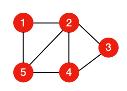
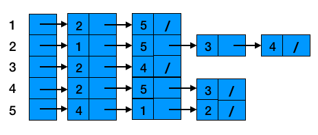
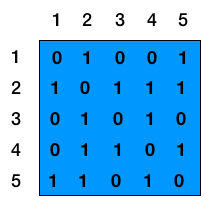

# 图

- [x] 图的相关概念介绍
- [x] 图的算法实现
- [x] 图的遍历
- [ ] 最小生成树
- [ ] 单源最短路径

### 图的相关概念介绍

- 图: 图是由顶点以及顶点见的关系集合组成的一种数据结构
- 路径: 所有顶点都由边连接构成；路径长度为第一个定点到最后一个顶点之间的数量
- 环: 指向自身的顶点，长度为0
- 有向图: 顶点x到顶点y是一条有向边
- 无向图: 顶点x到顶点y是一条无向边
- 连通图: 在无向图中，若从顶点x到顶点y有路径，则称顶点v1和v2是连通的。如果图中的任意一对顶点都是连通的，则称连通图
- 生成树: 一个无向连通图的生成树是它的极小连通子图
- 稀疏图和稠密图: 有很少条边或弧（边的条数E远小于$V^2$）的图称为稀疏图, 反之称为稠密图


### 图的表示方式

图的表示方式有两种

- 邻接表:领接表保存各个顶点所连接的其他顶点的信息, 适用于稀疏图
- 邻接矩阵: 将所有顶点的信息组织成一个顶点表，然后利用一个矩阵来表示各顶点之间的邻接关系,称为邻接矩阵，适用于稠密图

假设无向图如下



则用邻接表表示为



邻接表表示由一个包含n条链表的数组adj组成，每个节点有一条链表。对于每个节点v，邻接链表adj[v]包含所有与节点v之间有边相连的节点u。代码中，数组adj将作为图的一个属性，记录着各个节点之间的连接关系。所以上图中的关系用adj可以表示为

```javascript
[[2, 5], [1, 3, 4, 5], [2, 4], [2, 3, 5], [1, 2, 4]]
```
但是对于邻接表来说却有一个缺陷，无法快速判断一条边(u, v)是否在图中。唯一的办法就是搜索adj[u]是否含有v，邻接矩阵则克服了这个缺陷，但会占用更大的空间。

邻接表算法实现可以查看[这里](https://github.com/lybenson/algorithm/blob/master/dataStructure/graph/sparsGraph.js)

上面的无向图用邻接矩阵表示为



对于邻接矩阵来说，我们通常会将图中的节点编号，形成一个二维数组g。若某两个节点i和j存在一条边，则`g[i][j]=g[j][i]=1`,若是一条有向边从i到j，则只有`g[i][j]=1`，无边则表示为0。对于判断一条边(u, v)是否在图中，可以快速判断`g[u][v]`是否为1。

同时我们也观察到无向图的邻接矩阵其实是一个对称矩阵。由于在无向图中，边(u, v)和边(v, u)是同一条边，无向图的邻接矩阵就是自己的转置

邻接矩阵的算法实现可以查看[这里](https://github.com/lybenson/algorithm/blob/master/dataStructure/graph/denseGraph.js)

### 图的遍历
从图中某一顶点出发访遍图中其余顶点，且使每一个顶点仅被访问一次，这一过程就叫做图的遍历。根据遍历路径的不同，通常有两种遍历图的方法：深度优先遍历和广度优先遍历。


* 深度优先搜索(DFS)：从图中某个顶点v出发，访问该顶点，然后依次从v的未被访问的邻接点出发继续深度优先遍历图中的其余顶点，直至图中所有与v有路径相通的顶点都被访问完为止。

```javascript
function dfs (v) {
  this.marked[v] = true
  if (this.adj[v]) {
    console.log('访问了节点' + v)
  }
  let s = this.adj[v]
  for (let i = 0; i < s.length; i++) {
    if (!this.marked[s[i]]) {
      this.dfs(s[i])
    }
  }
}
```

* 广度优先搜索(BFS)
  * 1.将起始节点放入队列中
  * 2.删除队列中的第一个元素, 将删除的元素标记为已访问
  * 3.在队列中放入删除元素关联的且未被访问的所有节点
  * 4.重复步骤2和3, 直到队列为空

```javascript
function bfs (s) {
  let queue = []
  queue.push(s)
  while(queue.length > 0) {
    let v = queue.shift() // 删除队列中第一个元素
    this.marked[v] = true // 将删除的元素标记为已访问
    
    console.log('访问了节点' + v)

    let b = this.adj[v] // 获取删除元素关联的顶点数组
    b.forEach(item => {
      if (!this.marked[item]) {
        queue.push(item)
      }
    })
  }
}
```

### 单源最短路径


